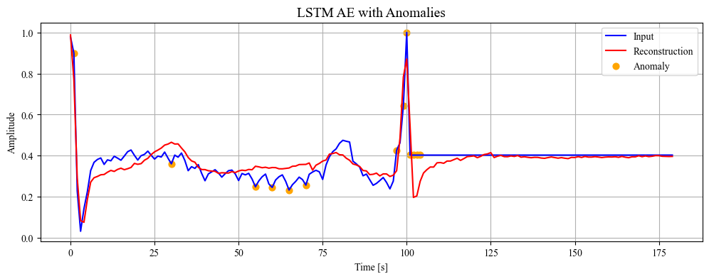

# 🩺 ECG Anomaly Detection

This repository contains code and resources for detecting anomalies in ECG data using various machine learning models.

## 📊 Dataset

The dataset used is the [ECG Heartbeat Categorization Dataset](https://www.kaggle.com/datasets/shayanfazeli/heartbeat/data) from Kaggle, which includes normal and abnormal heartbeat data from the PTB Diagnostic ECG Database.

## 🗂️ Project Structure

- **data/**: Contains the raw and processed data.
- **notebooks/**: Jupyter notebooks for data analysis and model training.
  - `EDA.ipynb`: Exploratory data analysis.
  - `vanilla_autoencoder.ipynb`: Anomaly detection using a Vanilla Autoencoder.
  - `lstm_autoencoder.ipynb`: Anomaly detection using an LSTM Autoencoder.
- **src/**: Python files and modules.
  - **data/**: Python files for data.
    - `data_preprocessing.py`: Scripts for data cleaning and preprocessing.
  - **features/**: Python files for feature engineering.
    - `statistics.py`: Scripts for creating statistical features from the raw data.
- **models/**: Source code for created models.
  - `IsolationForest.py`: Scripts for Isolation Forest model.
  - `Autoencoder.py`: Scripts for Vanilla Autoencoder model.
  - `LSTMAutoencoder.py`: Scripts for LSTM Autoencoder model.
- **main.py**: Main code to run all models.
- **README.md**: Project overview and instructions.
- **requirements.txt**: Python dependencies required to run the project.

## 🏆 Created Models

1. **Isolation Forest** 🌲
2. **Vanilla Autoencoder** 🤖
3. **LSTM Autoencoder** 🤖

The LSTM autoencoder provided the best results, successfully defining a threshold that accurately identifies anomalies in abnormal data with minimal false positives in normal data. In the image below, you can see the reconstructed abnormal signal and the detected anomalies:

## ⏭️ Next Steps

- 🔧 Fine-tune the model's hyperparameters for improved performance.
- ⚙️ Calibrate the model to reduce false positives further.
- 🧪 Explore additional models and techniques for better anomaly detection.
